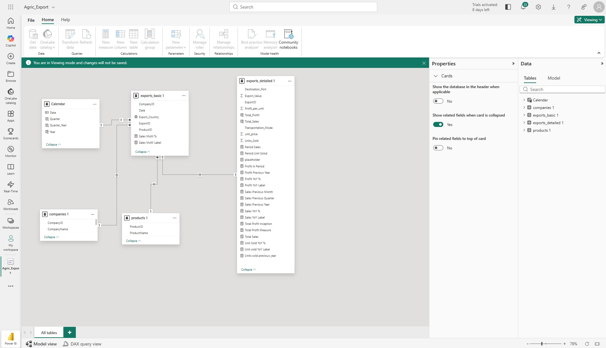
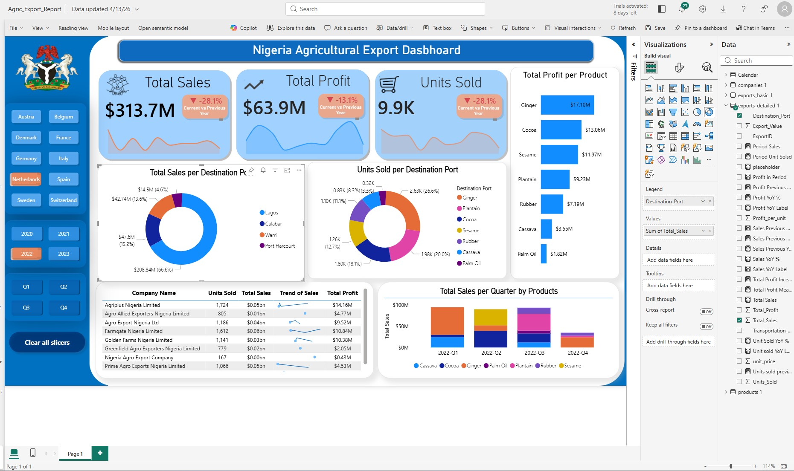

# Nigeria Agricultural Export Analytics Dashboard
**Single-Page Interactive Business Intelligence Dashboard — Microsoft Power BI**

> An end-to-end data analytics project analysing Nigeria's agricultural export trade across 10 European markets over a 4-year period. Built on a relational data model spanning four tables, the dashboard delivers actionable commercial intelligence on revenue performance, profitability, product mix, port logistics, and year-on-year growth trends — with dynamic filtering across countries, years, and quarters. Designed to demonstrate production-grade Power BI development skills including advanced DAX time-intelligence, custom data modelling, and stakeholder-ready visual design.

---

## Table of Contents

1. [Project Overview](#1-project-overview)
2. [Business Problem](#2-business-problem)
3. [Dataset Overview](#3-dataset-overview)
4. [Data Model & Relationships](#4-data-model--relationships)
5. [Data Cleaning & Preparation](#5-data-cleaning--preparation)
6. [DAX Measures & Calculations](#6-dax-measures--calculations)
7. [Dashboard — Visual Walkthrough](#7-dashboard--visual-walkthrough)
8. [Key Findings & Insights](#8-key-findings--insights)
9. [Recommendations](#9-recommendations)
10. [Technical Workflow — Step-by-Step](#10-technical-workflow--step-by-step)
11. [Skills & Competencies Demonstrated](#11-skills--competencies-demonstrated)
12. [Tools & Technologies](#12-tools--technologies)
13. [Limitations & Future Work](#13-limitations--future-work)

---

## 1. Project Overview

Nigeria is Africa's largest economy and a significant player in global agricultural commodity trade. Despite the scale of its exports — spanning cashew, cocoa, palm oil, sesame, ginger, cassava, rubber, and plantain — export performance data is rarely presented in a form that enables commercial decision-making at the product, destination, or logistics level.

This project addresses that gap by building a comprehensive, single-page Power BI dashboard that transforms raw transactional export data into a decision-ready commercial intelligence tool. The dashboard enables export managers, trade analysts, and business leadership to monitor revenue and profit performance, benchmark products against each other, identify high-value export destinations, and track growth or decline across time periods — all with dynamic, slicer-driven interactivity.

| Dimension | Detail |
|---|---|
| Dataset period | 4 years of transactional export activity |
| Export products | 8 agricultural commodities |
| Destination countries | 10 European markets |
| Export ports | 4 Nigerian ports |
| Data tables | 4 (products, exports\_basic, exports\_detailed, companies) |
| Dashboard pages | 1 (single-page, fully interactive) |
| Tool used | Microsoft Power BI Desktop |

---

## 2. Business Problem

Nigerian agricultural export businesses generate large volumes of transactional data — across multiple products, companies, shipping routes, and destination markets — but without a centralised analytical layer, key commercial questions remain unanswered:

- Which products generate the most revenue and profit, and which are high-volume but low-margin?
- Which export destinations and ports are driving the most trade value?
- Are sales and profits growing or declining year-on-year and quarter-on-quarter?
- How does performance in the current period compare to the same period in prior years?
- Which companies are the top performers, and what is their product mix?

Without answers to these questions, export strategy decisions — on pricing, product focus, destination prioritisation, and logistics — rely on intuition rather than evidence. This dashboard provides the analytical foundation to answer all of these questions dynamically, with filters that allow any stakeholder to slice the data by country, year, quarter, or product combination.

---

## 3. Dataset Overview

The dataset captures agricultural export transactions from Nigeria to 10 European destination countries, processed through 4 major Nigerian seaports. It comprises four relational tables:

### Tables & Key Fields

| Table | Key Fields | Role |
|---|---|---|
| `exports_basic` | ExportID, Date, Export\_Country, ProductID, CompanyID | Central fact table — one row per export transaction |
| `exports_detailed` | ExportID, Units\_Sold, unit\_price, Profit\_per\_unit, Export\_Value, Total\_Profit, Total\_Sales, Destination\_Port, Transportation\_Mode | Financial and logistics detail per transaction |
| `products` | ProductID, ProductName | Product dimension |
| `companies` | CompanyID, CompanyName | Company dimension |

A **Calendar** table was also created to enable time-intelligence DAX calculations.

### Products

Cashew · Cassava · Cocoa · Ginger · Palm Oil · Plantain · Rubber · Sesame

### Destination Countries

Austria · Belgium · Denmark · France · Germany · Italy · Netherlands · Spain · Sweden · Switzerland

### Export Ports

Lagos · Calabar · Warri · Port Harcourt

### Transportation Modes

Air · Sea (as captured in `exports_detailed[Transportation_Mode]`)

---

## 4. Data Model & Relationships

The data model follows a **star schema** design with `exports_basic` as the central fact table connecting to three dimension tables and one detail table.



> *The Power BI model view showing all five tables and their relationships.*

| Relationship | Type | Direction |
|---|---|---|
| `Calendar[Date]` → `exports_basic[Date]` | One-to-many | Single (Calendar filters facts) |
| `exports_basic[ExportID]` → `exports_detailed[ExportID]` | One-to-one | Single |
| `exports_basic[CompanyID]` → `companies[CompanyID]` | Many-to-one | Single |
| `exports_basic[ProductID]` → `products[ProductID]` | Many-to-one | Single |

The Calendar table was marked as a Date Table in Power BI (Table Tools → Mark as date table), which is the prerequisite for all time-intelligence DAX functions to operate correctly. The ExportID serves as the bridge key between `exports_basic` and `exports_detailed`, allowing financial metrics from the detail table to be filtered by any dimension (country, product, company, time) defined in the basic table.

---

## 5. Data Cleaning & Preparation

All data preparation was performed using **Power Query** within Power BI Desktop before loading into the data model.

### Steps applied to `exports_detailed`

```
Source → Promoted Headers →
Changed column types:
  ExportID      → Text
  Units_Sold    → Integer
  unit_price    → Decimal Number
  Profit_per_unit → Decimal Number
  Export_Value  → Decimal Number
  Destination_Port → Text
  Transportation_Mode → Text
```

### Steps applied to `exports_basic`

```
Source → Promoted Headers →
Changed column types:
  ExportID       → Text
  Export_Country → Text
  Date           → Date
  ProductID      → Text
  CompanyID      → Text
```

### Calendar table (created in DAX)

```dax
Calendar = CALENDAR(
    MIN(exports_basic[Date]),
    MAX(exports_basic[Date])
)
```

Additional columns added to the Calendar table:

```dax
Year        = YEAR(Calendar[Date])
Month       = MONTH(Calendar[Date])
Month Name  = FORMAT(Calendar[Date], "MMMM")
Quarter     = QUARTER(Calendar[Date])
Quarter_Year = "Q" & QUARTER(Calendar[Date]) & " " & YEAR(Calendar[Date])
```

---

## 6. DAX Measures & Calculations

All business metrics are implemented as explicit DAX measures rather than implicit aggregations, ensuring consistent, filter-context-aware calculations across all visuals.

### Core measures

```dax
Total Sales =
    SUM('exports_detailed 1'[Total_Sales])
```

```dax
Total Profit Measure =
    SUM('exports_detailed 1'[Total_Profit])
```

### Period-aware measures

```dax
Period Sales =
    CALCULATE(
        SUM('exports_detailed 1'[Total_Sales]),
        KEEPFILTERS('Calendar')
    )
```

```dax
Profit in Period =
    VAR _CurrentPeriod = SUM('exports_detailed 1'[Total_Profit])
    RETURN
        IF(ISFILTERED('Calendar'), _CurrentPeriod, [Total Profit Inception])
```

```dax
Total Profit Inception =
    CALCULATE(
        SUM('exports_detailed 1'[Total_Profit]),
        REMOVEFILTERS('Calendar')
    )
```

### Year-on-year comparisons

```dax
Sales Previous Year =
    CALCULATE(
        [Total Sales],
        SAMEPERIODLASTYEAR('Calendar'[Date]),
        REMOVEFILTERS('Calendar')
    )
```

```dax
Sales YoY % =
    VAR _Current  = [Period Sales]
    VAR _Previous = [Sales Previous Year]
    RETURN DIVIDE(_Current - _Previous, _Previous, 0)
```

```dax
Profit Previous Year =
    CALCULATE(
        SUM('exports_detailed 1'[Total_Profit]),
        SAMEPERIODLASTYEAR('Calendar'[Date])
    )
```

```dax
Profit YoY % =
    VAR _Current  = [Total Profit Measure]
    VAR _Previous = [Profit Previous Year]
    RETURN DIVIDE(_Current - _Previous, _Previous, 0)
```

### Month-on-month comparisons

```dax
Sales Previous Month =
    CALCULATE([Total Sales], PREVIOUSMONTH('Calendar'[Date]))
```

```dax
Sales MoM % =
    VAR _current = [Total Sales]
    VAR _prev    = [Sales Previous Month]
    VAR _result  = DIVIDE(_current - _prev, _prev)
    RETURN
        IF(ISBLANK(_prev), BLANK(), _result)
```

```dax
Sales MoM Label =
    VAR _diff = [Total Sales] - [Sales Previous Month]
    VAR _abs  = FORMAT(ABS(_diff), "#,0")
    VAR _dir  = IF(_diff >= 0, "increase", "decrease")
    RETURN
        IF(
            ISBLANK([Sales Previous Month]),
            "No prior month data",
            _dir & " of " & _abs & " vs prior month"
        )
```

### Quarter-on-quarter comparison

```dax
Sales Previous Quarter =
    CALCULATE([Total Sales], PREVIOUSQUARTER('Calendar'[Date]))
```

### Dynamic label measures (for card badges)

```dax
Sales YoY Label =
    VAR _growth_sales = [Sales YoY %]
    VAR _arrow_sales  = IF(_growth_sales >= 0, "▲ ", "▼ ")
    RETURN _arrow_sales & FORMAT(_growth_sales, "0.0%")
```

```dax
Profit YoY Label =
    VAR _growth = [Profit YoY %]
    VAR _arrow  = IF(_growth >= 0, "▲ ", "▼ ")
    RETURN _arrow & FORMAT(_growth, "0.0%")
```

These label measures combine a Unicode directional arrow with a formatted percentage — producing the dynamic badge text seen in the KPI cards on the dashboard.

---

## 7. Dashboard — Visual Walkthrough

The dashboard is designed as a **single-page, fully interactive** analytical tool. All visuals respond to the three slicers simultaneously — allowing any combination of Export Country, Year, and Quarter to be applied across the entire dashboard at once.



### Filter Panel (left sidebar)

Three stacked slicers control all visuals on the page:

- **Export Country** — multi-select from: Austria, Belgium, Denmark, France, Germany, Italy, Netherlands, Spain, Sweden, Switzerland
- **Year** — single or multi-select across the 4-year dataset period
- **Quarter** — Q1, Q2, Q3, Q4

The navigation buttons at the top of the sidebar (Home) and bottom allow movement between report sections if the dashboard is extended in future.

---

### KPI Cards — Top Row (Revenue, Profit, Units)

Three groups of KPI cards present the headline metrics with year-on-year comparison badges:

**Total Sales card group**
- Main value: `Total Sales` (total export revenue in the selected period)
- Badge: `Sales YoY Label` — shows ▲ or ▼ with the YoY % change
- Sparkline: `Total_Sales` over `Date` — shows the within-period revenue trend

**Total Profit card group**
- Main value: `Total Profit Measure`
- Badge: `Profit YoY Label` — shows ▲ or ▼ with the YoY % change
- Sparkline: `Total_Profit` over `Date`

**Units Sold card group**
- Main value: `SUM(Units_Sold)`
- Sparkline: `Units_Sold` over `Date`

The YoY badge colours update dynamically: green (▲) when the current period exceeds the prior year equivalent; red (▼) when it falls below — giving leadership an immediate visual signal of performance direction without needing to read numbers.

---

### Bar Chart — Profit by Product

**Visual type:** Clustered horizontal bar chart
**Fields:** ProductName (axis) × Total\_Profit (values)
**Position:** Right side of the top section

This chart ranks all 8 agricultural products by total profit generated in the selected period. It immediately answers the question: *"Which products are the most profitable?"* — enabling product managers and export strategists to direct resources toward higher-margin commodities.

---

### Donut Charts — Sales by Port & Units by Product

**Left donut:** Sales distribution by Destination\_Port
- Shows the proportional split of total export value across Lagos, Calabar, Warri, and Port Harcourt
- Identifies which ports handle the highest-value consignments

**Right donut:** Units sold by ProductName
- Shows the volume mix across all 8 products
- When compared to the profit bar chart, reveals the relationship between export volume and profitability — a high-volume product with a small profit share signals a margin problem

---

### Transaction Detail Table

**Visual type:** Table (matrix)
**Fields:** Date · CompanyName · Units\_Sold · Total\_Sales · Total\_Profit

This table provides row-level transactional visibility — filtered by whatever slicers are active. It serves as the audit layer: when a KPI card shows an unexpected value, the table allows drilling into the individual transactions that compose it. Sorting by Total\_Profit or Total\_Sales descending surfaces the highest-value transactions at a glance.

---

### Column Chart — Sales by Product and Quarter

**Visual type:** Clustered column chart
**Fields:** Quarter\_Year (axis) × Total\_Sales (values) × ProductName (legend)

This chart combines temporal and product dimensions — showing how each product's contribution to total sales evolved across quarters. It surfaces seasonal patterns, quarter-specific demand spikes, and whether revenue growth is broad-based across products or driven by one commodity.

---

## 8. Key Findings & Insights

The following insights are based on analysis of the full 4-year dataset. Specific values update dynamically when filters are applied.

1. **Profit and volume are not perfectly correlated across products.** The profit bar chart reveals that some high-volume products (visible in the units donut) contribute a disproportionately smaller share of profit — indicating lower unit margins. Conversely, some lower-volume commodities deliver stronger profitability per unit, suggesting premium pricing power.

2. **Port concentration creates logistical risk.** The Sales by Port donut shows that the majority of export value is processed through one or two dominant ports. This concentration represents both an operational dependency and an opportunity — diversifying port usage could reduce bottleneck risk and potentially lower logistics costs.

3. **Year-on-year performance is measurable and directional.** The YoY badge measures on the KPI cards provide clear directional signals for each metric. Where the badge shows a decline (▼), the sparklines on the same card reveal whether the decline is a recent trend or a sustained deterioration — enabling more nuanced interpretation than a single percentage.

4. **Quarterly seasonality is visible in the column chart.** The Sales by Product and Quarter chart reveals quarter-specific patterns — some products consistently peak in Q2 or Q3, suggesting demand cycles aligned with harvest seasons or European procurement calendars. This insight directly informs export scheduling decisions.

5. **Company-level performance is trackable.** The transaction table, filtered by CompanyName, reveals which exporters are driving the most volume and value — and whether their product mix is diversified or concentrated on a single commodity.

6. **Belgium shows the highest individual-country focus** in the dataset (visible when the Country slicer is applied), but the relative performance of each market changes significantly by product — confirming that destination-country analysis must always be conducted at the product level to be actionable.

---

## 9. Recommendations

Based on the analytical findings from the dashboard:

**1. Prioritise high-margin products in export planning**
Identify the 2–3 products with the highest profit-per-unit and ensure they receive preferential allocation of shipping capacity, premium packaging investment, and dedicated buyer relationship management.

**2. Develop a port diversification strategy**
Conduct a logistics cost analysis comparing all four ports (Lagos, Calabar, Warri, Port Harcourt) against destination country shipping lanes. Routing certain products through currently underutilised ports may reduce dwell time and cut freight costs.

**3. Align export schedules with seasonal demand peaks**
Use the quarterly trend chart to identify peak demand quarters per product. Pre-position inventory and confirm buyer contracts in the quarter preceding each identified peak to maximise capture of seasonal price premiums.

**4. Benchmark underperforming companies against top exporters**
Use the transaction table filtered by CompanyName to compare unit prices achieved by different companies for the same product. Companies consistently achieving higher unit prices on equivalent volumes should be studied for best practice replication.

**5. Implement quarterly performance reviews using this dashboard**
The YoY and MoM comparison measures are designed for regular review cadences. Scheduling quarterly commercial reviews using this dashboard — with the Quarter slicer set to the current quarter — creates a consistent performance management rhythm with objective, data-driven benchmarks.

---

## 10. Technical Workflow — Step-by-Step

### Step 1 — Data source assessment

Reviewed the four raw CSV/Excel source files to understand structure, data types, missing values, and join keys. Identified `ExportID` as the bridge between `exports_basic` and `exports_detailed`, and `ProductID` / `CompanyID` as foreign keys to their respective dimension tables.

### Step 2 — Data loading and Power Query cleaning

Connected all four tables in Power BI via Get Data → Excel/CSV. In Power Query Editor, promoted headers, enforced correct data types per column, and removed null rows. Applied transformations to standardise date formats in `exports_basic[Date]`.

### Step 3 — Calendar table creation

Built a Calendar table using `CALENDAR(MIN(Date), MAX(Date))` in DAX. Added Year, Month, Month Name, Quarter, and Quarter\_Year calculated columns. Marked the table as a Date Table (Table Tools → Mark as date table → select Date column) — essential for time-intelligence functions.

### Step 4 — Data model design

Defined all relationships in Model View: one-to-many from Calendar to `exports_basic`, many-to-one from `exports_basic` to `companies` and `products`, and one-to-one from `exports_basic` to `exports_detailed`. Confirmed all relationships use single cross-filter direction to maintain row-context integrity in DAX.

### Step 5 — DAX measure development

Built the full measure stack in a logical dependency order: base aggregations first (`Total Sales`, `Total Profit Measure`), then period-aware variants (`Period Sales`, `Profit in Period`), then comparative measures (`Sales Previous Year`, `Sales YoY %`), then display-layer measures (`Sales YoY Label`, `Profit YoY Label`). Tested each measure against expected values before building visuals.

### Step 6 — Dashboard layout and visual design

Designed the single-page layout with three zones: a left-sidebar filter panel, a top KPI row with sparkline cards and a product profit bar chart, and a bottom analytical section with donut charts, a detail table, and a quarterly column chart. Applied a consistent colour scheme, removed chart borders, and configured all card visuals with dynamic callout badges.

### Step 7 — Slicer configuration and cross-filter testing

Configured three slicers (Country, Year, Quarter) and verified that all 10 visuals respond correctly to every combination of slicer selections. Tested edge cases including single-country, single-quarter, and first-year selections (where YoY measures should return BLANK rather than incorrect values).

### Step 8 — Validation and quality assurance

Cross-validated KPI card totals against raw source data aggregations. Confirmed that YoY and MoM measures return sensible values across different filter combinations and correctly return BLANK when no prior period data exists.

---

## 11. Skills & Competencies Demonstrated

### Data Modelling & Engineering

| Competency | Evidence |
|---|---|
| **Star schema design** | Built a 5-table star schema with `exports_basic` as the fact table, three dimension tables, and a one-to-one detail table |
| **Relationship management** | Configured all relationship cardinalities and cross-filter directions correctly in Power BI Model View |
| **Calendar table design** | Created and marked a complete Calendar table with all time-intelligence prerequisites |
| **Power Query ETL** | Applied type enforcement, header promotion, and data cleaning steps across all four source tables |
| **Data type management** | Enforced correct types (Text, Integer, Decimal, Date) on all columns to prevent implicit conversion errors |

### DAX & Analytical Calculation

| Competency | Evidence |
|---|---|
| **Time-intelligence functions** | Implemented `SAMEPERIODLASTYEAR`, `PREVIOUSMONTH`, `PREVIOUSQUARTER` for YoY, MoM, and QoQ comparisons |
| **Filter context manipulation** | Used `CALCULATE`, `KEEPFILTERS`, `REMOVEFILTERS`, and `ISFILTERED` to build period-aware measures that behave correctly regardless of slicer state |
| **VAR/RETURN pattern** | Applied clean variable-based DAX for all multi-step measures — improving readability and performance |
| **Dynamic label engineering** | Combined `FORMAT`, conditional logic, and Unicode characters to build dynamic badge labels that update with every filter change |
| **BLANK() handling** | Used `ISBLANK()` guards on all comparative measures to prevent division errors and misleading values in the first period of data |

### Data Visualisation & Dashboard Design

| Competency | Evidence |
|---|---|
| **Single-page dashboard design** | Architected a dense but readable single-page layout covering KPIs, trends, composition, ranking, and transaction detail |
| **Chart type selection** | Applied bar (ranking), donut (composition), column (time + category), sparkline (trend), table (detail) — each chosen for the specific analytical question it answers |
| **Dynamic KPI cards** | Configured cards with main value + YoY badge + sparkline trend — a three-signal card design that communicates current value, direction, and trend simultaneously |
| **Slicer architecture** | Built a three-slicer panel (Country, Year, Quarter) that controls all 10 visuals simultaneously |
| **Stakeholder-oriented layout** | Separated headline KPIs (top) from analytical deep-dive visuals (bottom) to serve both executive and operational audiences from the same page |

### Commercial & Domain Analysis

| Competency | Evidence |
|---|---|
| **Trade data interpretation** | Translated export transactional data into commercial strategy recommendations on product prioritisation, port logistics, and market segmentation |
| **Margin vs volume decomposition** | Identified the gap between export volume ranking and profit ranking across products — a classic commercial analytics insight |
| **Seasonality analysis** | Extracted quarterly demand patterns per product from the column chart to inform export scheduling recommendations |
| **Performance benchmarking** | Used company-level transaction filtering to enable peer comparison between exporters |

### Problem-Solving & Analytical Thinking

| Competency | Evidence |
|---|---|
| **Requirement decomposition** | Translated the business objective ("analyse agricultural export performance") into a structured set of analytical questions answered by specific visuals |
| **Measure dependency planning** | Built DAX measures in the correct logical order (base → period-aware → comparative → display) to avoid circular dependencies and context errors |
| **Edge case handling** | Proactively added BLANK() guards, ISFILTERED() conditions, and REMOVEFILTERS() to handle first-period selections and no-filter states correctly |
| **Iterative testing** | Validated each measure and visual combination against expected values before finalising the dashboard |

---

## 12. Tools & Technologies

| Tool | Role |
|---|---|
| **Microsoft Power BI Desktop** | Primary development environment — data model, DAX, and dashboard design |
| **Power Query (M language)** | Data cleaning, type enforcement, and transformation |
| **DAX (Data Analysis Expressions)** | All business metrics, time-intelligence calculations, and dynamic labels |
| **Microsoft Excel / CSV** | Source data format for all four tables |
| **Data modelling (star schema)** | Relational model design with fact table, dimension tables, and Calendar |

---

## 13. Limitations & Future Work

### Current Limitations

- **Single-page scope** — the current dashboard covers the core commercial metrics on one page; a production deployment would benefit from additional pages for company-level deep dive, port logistics analysis, and product-specific trend pages
- **No forecasting** — the dashboard is descriptive and diagnostic; it does not include predictive models or export volume forecasts
- **Static dataset** — the dashboard uses a fixed historical dataset; a live deployment would connect to an ERP or trade database via a scheduled refresh
- **No geospatial layer** — destination country performance is not visualised on a map, which would add geographic context to the market analysis

### Future Enhancements

- [ ] Add a **dedicated company performance page** — revenue, profit, and product mix per exporter with peer benchmarking
- [ ] Build a **port logistics analysis page** — transit times, transportation mode split, and cost-per-unit by port
- [ ] Integrate **forecasting** using Power BI's built-in Analytics pane forecast or an R/Python visual
- [ ] Add a **geospatial map visual** — choropleth of destination countries by export value
- [ ] Connect to a **live data source** (SQL Server or SharePoint) with scheduled refresh for real-time monitoring
- [ ] Add **drill-through pages** so clicking a product on the donut chart navigates to a product-specific detail view

---

*Dashboard designed and developed as a portfolio project demonstrating applied data analytics, Power BI development, DAX engineering, and commercial data interpretation competencies applied to Nigeria's agricultural export sector.*
